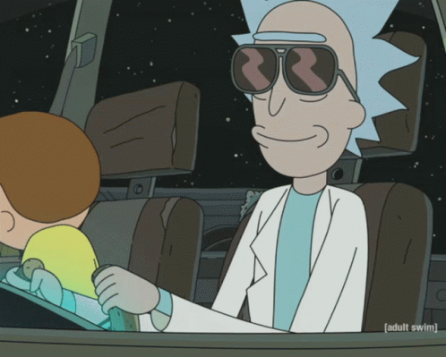

# API Rick and Morty

  
    
  

 

Este projeto tem a funcionalidade de:

<ul style="font-family:Castellar; font-size:15px">
    <li>Filtrar personagens na barra de pesquisa.</li>
    <li>Exibir as informações de cada personagem em seu card.</li>
    <li>Dar uma descrição detalhada no botão "mais detalhes" dentro do card.</li>
    <li>Exibir a musica tema do "Rick and Morty" ao apertar no botão de Play na parte superior direita.</li>
</ul>
 
  

<h2 style="font-family:Castellar">🌐 Apresentação da API</h2> 

Para ver mais da API de Rick and Morty, [clique aqui](https://api-de-rick-and-morty.vercel.app)

<h2 style="font-family:Castellar">🛠 Ferramentas Utilizadas</h2>

- **Linguagens:** 

  
  
  
  
- **Frameworks:** 

  

## 📞 Contate-me

